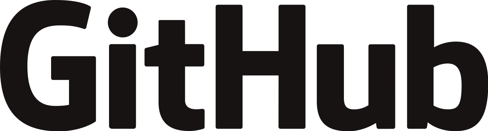

# Sharpened Skills

I didn’t know what to expect at the beginning of the semester. My motivation was to complete this course with a reasonable grade as required for my major. I can confidently say that after this experience I’ve acquired some of my most valuable knowledge yet. Amongst the many skills acquired over the semester, two, in particular, stood out to me:

- Configuration Management
- User Interface Frameworks (React)

These are what I consider to be the most important and influential modules I’ve learned.

## Merge With Confidence!

Configuration management can be hard to implement but easy to understand. Many people have already had some experience with configuration management. If you’ve used google docs and allowed people to share in editing a document, you are managing the configuration of your single document among multiple users.

Our tool of choice this semester was GitHub, in particular, GitHub Desktop (the desktop application version). The service allows you to manage files and version control across different platforms for almost seamless team collaboration. There are a lot of learning pains that come with first experiences with the system, but they are all eventually trumped by innovative design and ingenuity.

My experience with GitHub was simply amazing. It took some practice to truly understand how powerful this tool really is but it’s definitely a game changer. Open source projects are the future and GitHub is a strong ally in that realm. I hope the companies I work for will gladly apply some version of configuration management to their own projects as well.

## A Framework to Blow Your Mind

My first experience with frameworks this semester hyped me up for what was to come. As a novice, I never truly understood what a framework was until now. However, it's simple to grasp when you look at the word "framework". What is a framework? Well if you think of a house, it's a support structure the underlying some system. The concept is also applicable to programs. It's a support system that provides functionality for specific software that can be edited towards a user's needs.

Now I'm able to imitate web apps such as Facebook, Google, and Amazon across multiple browsers. But wait, I've been exposed to Javascript React! React is an open-source front-end JavaScript library that uses UI components for designing user interfaces. In essence, it combines the power of javascript and UI frameworks in one package. What an amazing advance in front-end design. React requires the use of other libraries to maintain a robust and intuitive architecture but the payoff is a very versatile way to develop intricate applications. 

## Honing These Skills

As I continue to learn more about software engineering, I plan to further practice my newly acquired skills in other projects I would like to be a part of. I feel as though I only experienced the tip of the iceberg when it comes to React. I want to dive into the deep end of the capabilities of this system. I also want to learn what the leaders in the industry are when it comes to software development utilities and how I can be a part of that community. By the end of my education, I want to have come out the sharpest blade I can possibly be.
