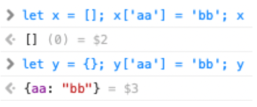
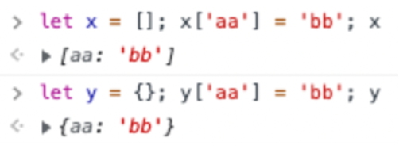

## What Does it Mean to Work Smarter?

The phrase “work smarter” has been passed around an enumerable amount of times. It’s an ideology that infers that people should focus less on the tasks at hand and instead more on completing the tasks with diminishing effort. A simple yet powerful mantra to use when tedious problems present themselves. When these problems happen, the first step is always to understand what the problem is. How can we do this effectively?

## Ok, So What Should You do?

Time spent understanding a problem can vary pending on how an individual approaches the situation. In my humble opinion, the most effective way for someone to understand a problem is to seek guidance from another person who has experienced it. Why read an entire book on modern medicine when you only want to know how to soothe a sore throat? Asking good questions has become harder to master. Here’s what differentiates a good question from a bad one.

In a quick search in StackOverflow, I was able to find examples of what I believe are the makings of a good question, and a not-so-good question.

Example A,

*I have an array of JavaScript objects*

---

var objs = [  
  { first_nom: 'Lazslo', last_nom: 'Jamf'     },  
  { first_nom: 'Pig',    last_nom: 'Bodine'   },  
  { first_nom: 'Pirate', last_nom: 'Prentice' }  
];

---

*How can I sort them by the value of last_nom in JavaScript?*

*I know about sort(a,b), but that only seems to work on strings and numbers. Do I need to add a toString() method to my objects?*

This question popped up when I searched with tags including javascript, arrays, sorting, and comparison. The title is clear and concise, **_Sort array of objects by string property value_**. They immediately begin their post with a sample of their code to help support their follow-up question. The last part of their question asserted a symptom of their problem to help with analysis. I consider this to be a good question. Although the last sentence was a guess and could have been neglected, the rest of the inquiry was robust and allowed for further discussion on the issue.

Example B,

*I don't know if I didn't notice this before... or has it always been like this?*

  

*Brave:*

  

*In Safari it works logically, you want a string as a key then you should use a {} dictionary, but i guess it worked before the []arrays...?*

This question wasn’t even answered. My guess? It’s too vague. The title is **_Since when Safari not allow to use a string as an array key?_** Ignoring the obvious syntactical errors, the question itself is easy to understand, but it lacks extra details that would allow the reader to respond with a worthy answer. What is “this” he’s referring to? Has it always been like what specifically? The closing section of his question has him guessing what the answer may be without describing the symptoms of his problem. Imagine telling a doctor you think you are sick but instead of telling him your symptoms, you start guessing “maybe it’s pneumonia? Or perhaps I have gout?” Another important detail he missed is uploading two images relating to his problem without any details on what his images propose.

## What's the Take Away?

Both examples showcase what I believe separates a smart question from a not-so-smart question. Understanding the difference between one and the other can save valuable time and effort while allowing the user to focus on rectification.

Source: [Sort array of objects by string property value](https://stackoverflow.com/questions/1129216/sort-array-of-objects-by-string-property-value)  

Source: [Since when Safari not allow to use a string as an array key?](https://stackoverflow.com/questions/70743406/since-when-safari-not-allow-to-use-a-string-as-an-array-key)  
