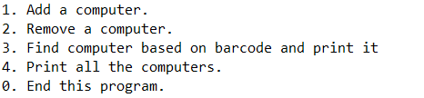

This is a console application that I created back in ICS 211. Though simple and unrefined, this particular project was special to me because it was the culmination of everything I learned about Java at the time.

I don’t have much to say about how it runs, which is a great thing! Why? Because the application, while simple, is very user-friendly. The greatest challenge about this project was making sure all the files ran in tandem. The program includes many error checks and focuses on a friendly user interface.

When run, the console will display a menu asking the user to input options. It’s up to the user to follow the instructions on the screen. There are many options the choose from such as recording barcodes, searching lists for nodes, and printing certain nodes based on their properties.

I’m still new to programming, but this was my proudest accomplishment thus far.

Source: <a href="https://github.com/https://github.com/carakaki808/LinkedLists"><i class="large github icon "></i>carakaki808/LinkedLists</a>

