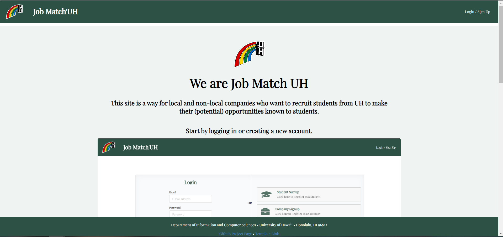
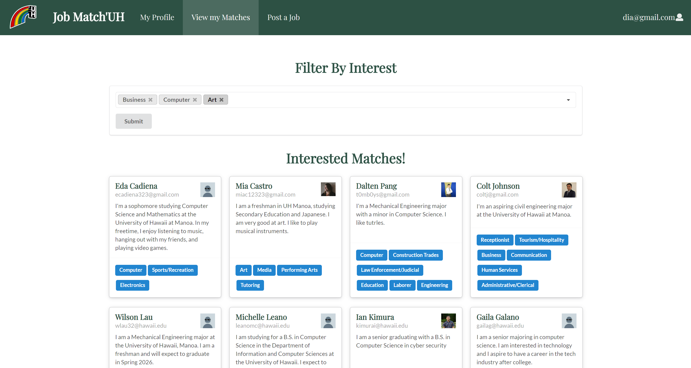

## Our Brain Child

This is a project I worked on with 4 other group members towards the ending of our semester in ICS 314. The application is a simple way for companies to post job opportunities for students to match with and view. Our app was inspired by other popular medias such as linkedin and indeed.

## Quality Assurance

My contribution to this project started off by building the signup page used to input data for the student's profile. As the weeks went on I began moving towards the testing portion of our app where I would regularly test for page availability and form processing which largely became my main contribution.

## A Foot In the Door

I learned a great many skills during this experience such as working with a team developing an app, the purpose of and how to use testing efficiently, how to properly use configuration management, and the qualities of what makes a good application. Many of the skills I will continue to hone over the course of my career.

Source: <a href="https://job-match-uh.github.io/"><i class="large github icon "></i>Job Match UH homepage</a>