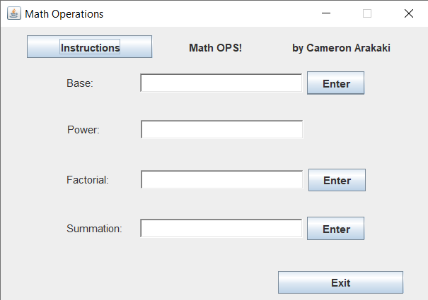

I solo designed this back in ICS 211. This project helped me understand recursion and apply it to a basic GUI.

This was another attempt at creating a basic GUI. The challenge here was writing a recursive function and implementing that function within an interface that was both practical and easy to use.

When the user runs the application, a window pops up with instructions on the top left panel giving a brief description of how the application works. There are three recursive math operations that the user can utilize. Each operation has text fields that will return an error if the number entered is not numerical or greater than -1. Answers are displayed at the bottom of the screen. By closing the window or pressing the exit button, the application terminates.
 
Source: <a href="https://github.com/carakaki808/RecursiveMathOp"><i class="large github icon"></i>carakaki808/RecursiveMathOp</a>
