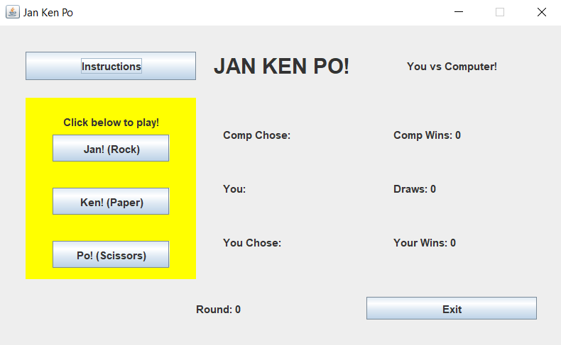

RockPaperScissors is a simple Java program that I solo developed in ICS 211. This project helped further my skills in Java and in particular GUI.

This is one of my first attempts at creating an application in Java. The challenge here was arranging buttons and panels in such a way that it was aesthetically pleasing.

When the application runs, you are given a window with several buttons on it as seen on the image to the right. Within the yellow panel, you can click a button that runs instructions to the computer to generate a random number within a given range (1-3). The random number is compared to the button choice and an outcome is displayed. The results are also recorded and saved as a readable file within the same folder as the source code.

The purpose of this application was to introduce me to GUIs. The project had the most trial and error. It required a lot of attention to aesthetics versus any other application I’ve had to make. Many buttons and panels had to be created including “dummy” panels that held no data and were used as placeholders to organize other blocks in meaningful ways. It was also expected that we were to design an application that would be user-friendly. The layout and instructions had to be simple and the output had to make sense.

Source: <a href="https://github.com/carakaki808/RockPaperScissors"><i class="large github icon "></i>carakaki808/RockPaperScissors</a>
